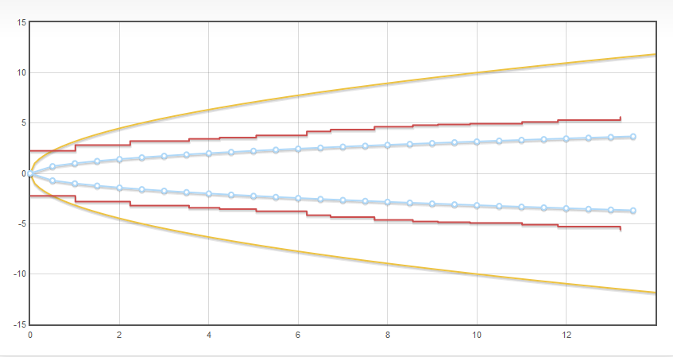

# jquery.flot.reflect
Reflect plugin for Flot

Reflects data by adding points with negated X or Y values.

This plugin adds two additional options to [Flot series objects](https://github.com/flot/flot/blob/master/API.md#customizing-the-data-series):

* `reflectX` - if `true`, then reflect (negate) X values
* `reflectY` - if `true`, then reflect (negate) Y values
